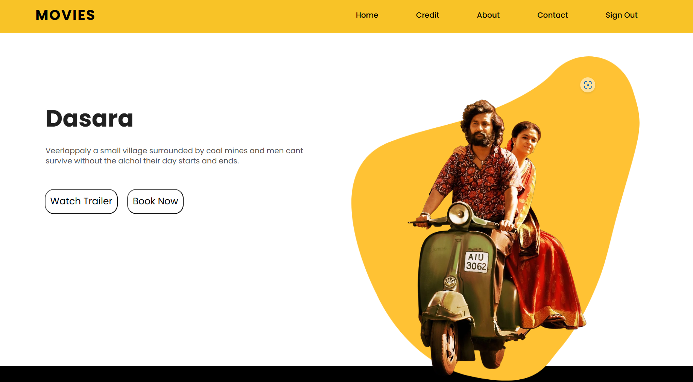

# MovieForever

**MovieForever** is a movie booking website that offers an easy and efficient way to browse movies, select seats, and book tickets. The site features a seat matrix for seat selection and generates a PDF ticket for each booking. Built using pure HTML, CSS, and JavaScript, it provides a user-friendly interface for managing your movie outings.

### Tech Stack

- **Frontend**: HTML, CSS, JavaScript

### Features

- **Movie Display**: Browse a list of current and upcoming movies.
- **Seat Matrix**: Select seats from an interactive seat matrix.
- **Ticket Booking**: Book tickets and confirm your selection.
- **PDF Generation**: Receive a PDF file of your booked tickets.

### Links

- [GitHub Repository](https://github.com/umamaheshdev01/Movie-Website/)
- [Live Demo](your-live-demo-link)
